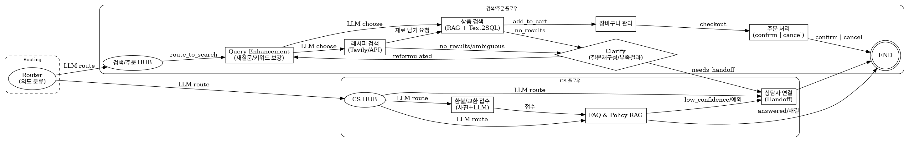
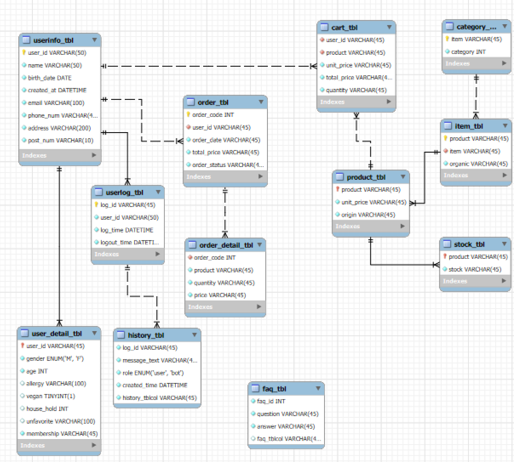

# Qook 신선식품 고객응대/주문 챗봇 — 빌드 플랜 (Claude Code용)
_업데이트: 2025-09-02_

> **다이어그램:** 아래 LangGraph 다이어그램의 흐름을 그대로 따릅니다.  
> 

## 프로젝트 목표
신선식품 플랫폼의 **주문/검색**과 **CS(고객응대)** 를 모두 처리하는 프로덕션급 챗봇을 구축합니다.  
라우팅은 **LLM 기반**(하드코딩된 의도 라벨 없음)이며, CS 영역의 문서 질의는 **FAQ & Policy RAG(통합)** 로 처리합니다.
2
## 기술 스택(권장, 유연함)
- **Python 3.11+**, **LangGraph**, **FastAPI**(또는 Django+ASGI), **SQLAlchemy**(Text2SQL 대상)
- **벡터DB**(FAISS/Chroma/Pinecone), **RDB**(MySQL) — 상품/주문
- **LLM**: OpenAI 계열(라우팅/재작성/응답 합성), **Vision**(이미지 인입)
- **Tavily(또는 동등 API)** — 레시피 검색
- **관측성**: 구조화 로그, 트레이스ID, 프롬프트/버전 태깅

---

## 단계별 실행 항목 & TODO (다이어그램 1:1 매핑)

### 1) Router (LLM route) → 검색/주문 HUB 또는 CS HUB
**실행**
- 입력 정규화(언어 감지, 공백/이모지 정리, 시스템 시각 포함)
- LLM 라우터: **검색/주문** vs **CS** 로 라우트(+ 신뢰도 점수)
- 신뢰도 낮음 → **Clarify** 로 분기(질문 재구성/부족결과 루프)

**TODO**
- [ ] 라우팅 프롬프트(국문 우선, 영문 백업) 작성
- [ ] 신뢰도 임계값 + 보류(abstain) 경로
- [ ] 세션 상태 스키마(user_id, session_id, turn_id)
- [ ] 텔레메트리: 원문/라우트/신뢰도 로깅

---

### 2) Query Enhancement (질문/키워드 보강)
**실행**
- 재작성: 작업 지향 문장으로 변환 + 키워드 확장
- 슬롯 추출: 수량, 카테고리, 배송창, 예산, 식이/알러지 등
- 안전: 개인정보/주문번호 등 민감정보 마스킹

**TODO**
- [ ] 재작성 + 슬롯 추출 프롬프트
- [ ] 키워드 생성기(BM25 친화적 토큰)
- [ ] PII 차단기(정규식 + 허용리스트)
- [ ] 단위 정규화(g↔kg, 팩/봉 등)

---

### 3) 상품 검색 (RAG + Text2SQL)
**실행**
- 경로 결정: **카탈로그 RAG** vs **Text2SQL**
- 스키마 프라이밍으로 SQL 생성, 검증 실패 시 RAG로 폴백
- 상품 랭킹/정렬 후 후보 세트 반환

**TODO**
- [ ] 상품 스키마 정의(테이블/컬럼)
- [ ] Text2SQL 시스템 프롬프트 + 스키마 프라이밍
- [ ] 읽기 전용 SQL 샌드박스 + 밸리데이터
- [ ] 리트리버 설정(k, 하이브리드, 필터)
- [ ] 응답 스키마: `[{sku, name, price, stock, score}]`

---

### 4) Clarify (no_results / ambiguous)
**실행**
- 결과 없음/다의성일 때 표적 질문을 생성, 제약 업데이트
- 업데이트된 상태로 상위 단계로 루프백

**TODO**
- [ ] 상황별(재고없음/가격/신선도/대체품) 질문 템플릿
- [ ] 루프 예산(예: 최대 2~3회)
- [ ] 한국어 공손체 문구 가이드

---

### 5) 장바구니 관리
**실행**
- 추가/수정/삭제, 재고·최소주문 규칙 검증
- 변형/옵션 병합, 합계·할인 계산

**TODO**
- [ ] 카트 스키마 + 멱등 업데이트
- [ ] 재고 서비스 연동
- [ ] 가격·쿠폰·프로모션 훅

---

### 6) Checkout → 주문 처리(confirm | cancel)
**실행**
- 체크아웃: 배송지, 배송창, 결제수단 수집
- 확정/취소; 주문 레코드 생성; 영수증 발행

**TODO**
- [ ] 결제 모의(stub) + 상태 매핑
- [ ] 주문 스키마/주문번호/감사로그(audit)
- [ ] 실패 복구(재시도 큐)

---

### 7) 레시피 검색 (Tavily/API)
**실행**
- 요리/재료 기반 외부 레시피 검색
- 재료 → 카탈로그 SKU 매핑, “장바구니 담기” 제안
- 검색한 레시피의 url 주소 제공

**TODO**
- [ ] Tavily 클라이언트 + 레이트리밋
- [ ] 재료 정규화 → SKU 매퍼
- [ ] 대체/품절 안내 문구
- [ ] 검색 레시피의 url 및 재료 제공

---

### 8) CS HUB
**실행**
- 접수: 반품/교환, 배송 이슈, 이미지(영수증/상품사진) 처리
- **FAQ&Policy RAG** 또는 **Handoff** 로 분기

**TODO**
- [ ] 비전+LLM 사진 분류 프롬프트
- [ ] 티켓 스키마 + SLA 태그
- [ ] 악성/모욕 응대 안전 가이드

---

### 9) FAQ&Policy RAG (통합)
**실행**
- FAQ/정책 말뭉치에서 근거 검색
- 인용 포함 응답 작성 + 신뢰도 게이팅

**TODO**
- [ ] 인덱스 빌더(FAQ/정책 파서)
- [ ] RAG 프롬프트(그라운딩 확인)
- [ ] 채팅 UI 인용 렌더링

---

### 10) 상담사 연결(Handoff)
**실행**
- 신뢰도 낮음/예외 카테고리 시 CRM/상담사로 이관
- 대화 요약·근거 묶음 전달

**TODO**
- [ ] CRM 웹훅 어댑터
- [ ] 대화 로그 민감정보 필터
- [ ] 사후 해결 상태 동기화 → END

---

### 11) 세션 종료(END)
**실행**
- 주문/CS 결과에 따른 마무리 메시지, 영수증/링크/요약 제공

**TODO**
- [ ] 결과 아티팩트 구조 정의(영수증 링크 등)
- [ ] 피드백 수집 훅

---

## 상태 & 계약
- 모든 노드는 공용 `ChatState` 를 입력/출력(부분 갱신)합니다.
- 노드는 **상태 diff** 만 반환하고, 다음 엣지를 힌트로 제안할 수 있습니다.
- 자세한 타입/스텁은 `graph_interfaces.py` 참조.

## 환경 변수 예시
```
VECTOR_STORE_DIR=./var/index
TAVILY_API_KEY=...
S3_ENDPOINT=...
OPENAI_API_KEY=...
```

## 실행 예시
- 로컬: `uvicorn app:api --reload`
- 테스트: `pytest -q`
- 인덱스 빌드: `python tools/build_index.py --faq ./data/faq --policy ./data/policy`

---

## 산출물 목록
- `FUNCTIONS.md` — 함수별 상세 설명/계약
- `graph_interfaces.py` — 노드 스텁(병렬 개발 안전)
- `team_plan.md` — 6인 분업 플랜
- `status_*.md` — 기능별 진행 상황 트래커

## ERD
- User, Databse를 만들고 User에게 권한을 부여해주는 setup.sql 작성
- 아래의 ERD는 대략적인 틀을 잡아 놓은 것으로, 필요한 column(sesson_id, history_id 등)이 있을 경우 자체 판단 후 추가 및 제거
- ERD를 수정해야할 경우, 수정본은 항상 ERD.md파일에 작성해놓을 것
- ERD 구성이 완료가 되면, 각 테이블에 더미로 사용할 더미 데이터를 seed.sql로 생성하여 미리 데이터를 만들어 둘 것
> 

# 매 채팅 시작시 고려사항
- 한국어로 대화 및 작성하기
- 모든 작업 내용은 각 기능에 맞춰 markdown파일을 만들어 기록해둘 것
- 채팅 세션 시작 전에 사용자에게 team_plan.md에 어떤 역할을 수행중인지 물어보고 그 수행에 맞게끔 행동할 것
- 반드시 기능별 해당하는 코드들만 수정해야하며, 절대로 다른 코드들을 임의로 수정해서는 안됨. 꼭 필요한 코드들만 수정할 것. 만약 수정할 시, 기록해둘 것
- 마크다운 파일들은 수정은 가능하나 절대 삭제하지 말 것.
- 임시로 테스트를 실행할 경우 ter_test 폴더를 만들어서 그 안에 임시 test 파일들을 생성하고 실행한 후 삭제할 것.(실행에 실패해도 삭제하고 실행이 완료되어도 삭제)