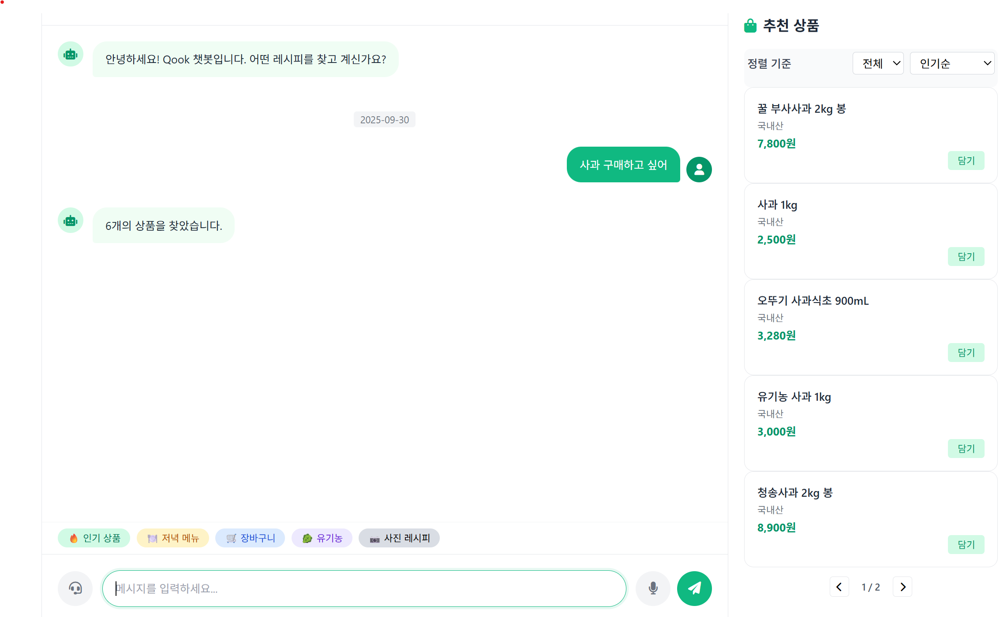
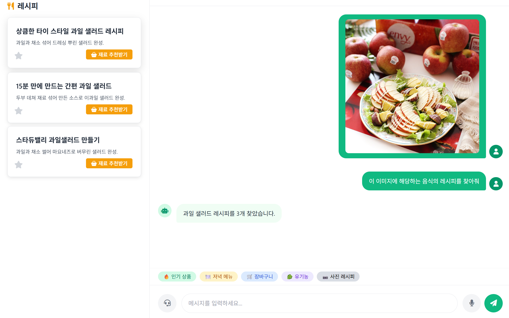
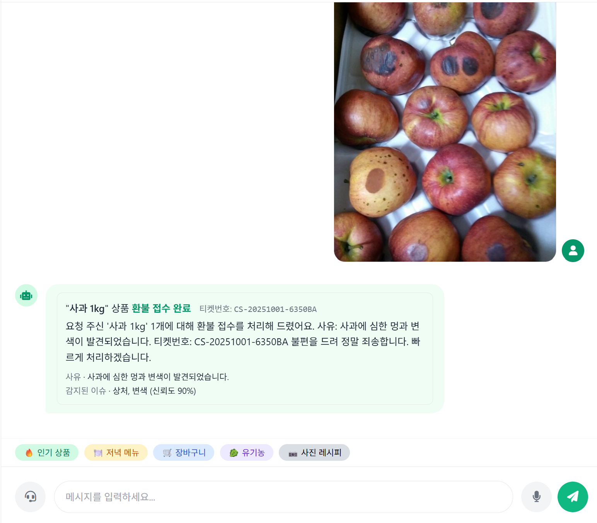
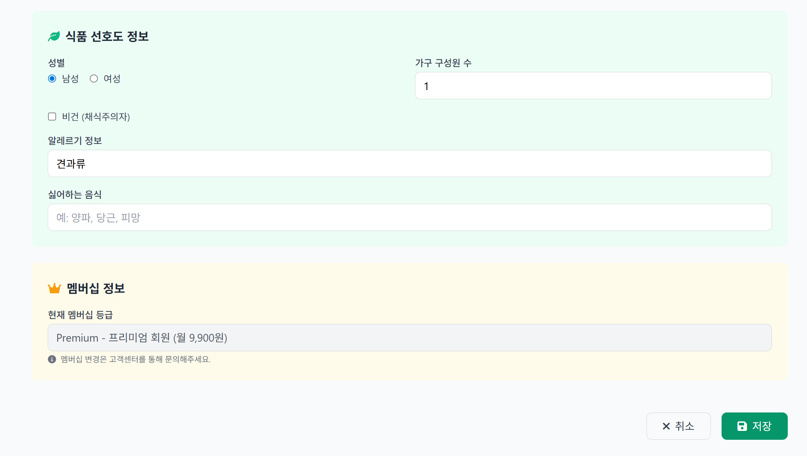
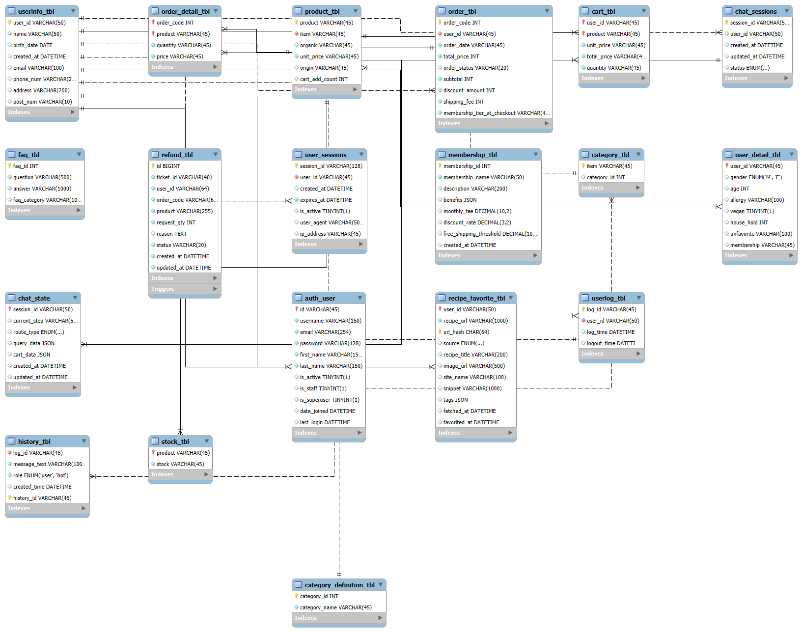
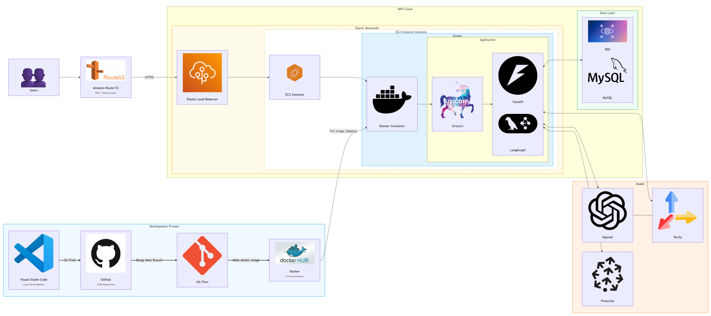
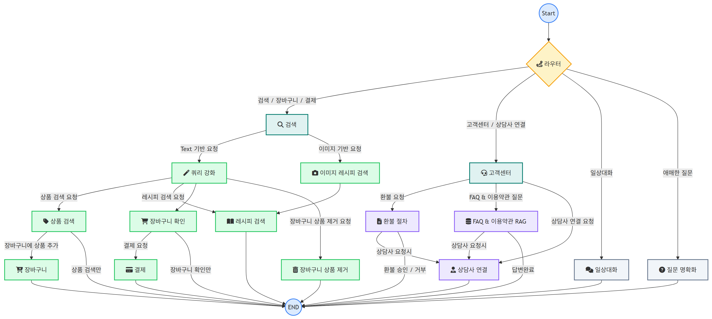
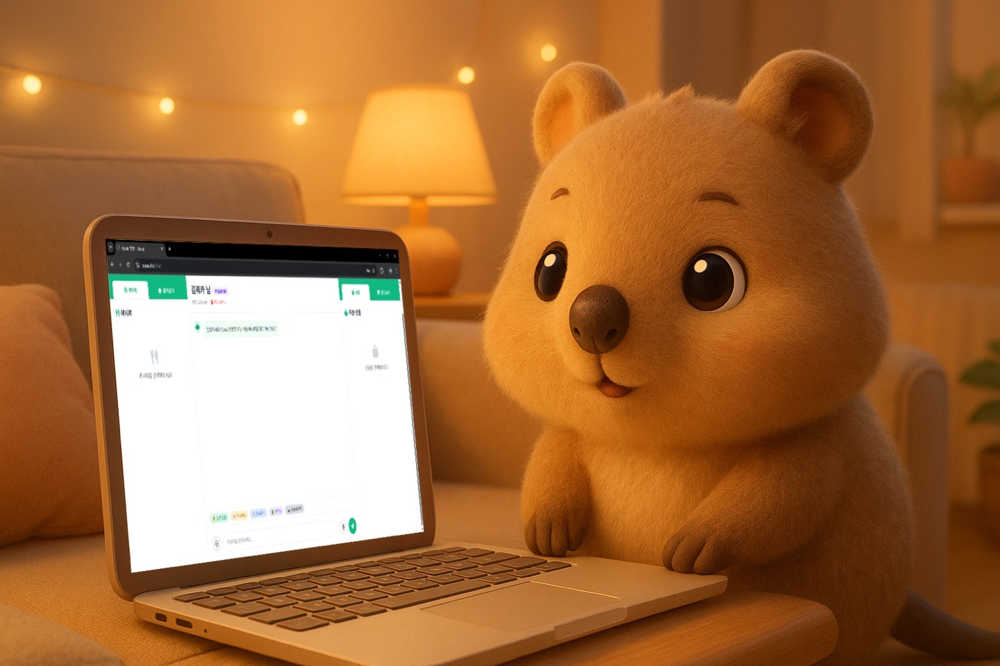

# Qook - AI 신선식품 챗봇 플랫폼

## 👥 팀 구성 및 역할

| 이름 | 주요 담당 |
|---|---|
| 하종수 (PM) | 프로젝트 총괄, 코드 병합·디버깅, AWS 배포 |
| 김광령 | 텍스트·이미지 기반 레시피/상품 검색 |
| 김성민 | 데이터베이스 구성, 마이페이지 제작, AWS 배포 |
| 문상희 | LangGraph 라우팅, 이미지 기반 환불, 멀티턴 채팅 |
| 서은선 | 데이터 수집, Vector DB · RAG |
| 송유나 | 랜딩/챗봇 UI, 이미지 기반 환불 |

---

## 개발 일정

- 08/11~08/14: 기획 & 시스템 설계/도메인 선정

- 08/18~08/22: 데이터 수집/전처리

- 08/25~08/27: RAG 구현

- 08/28~09/12: 모델링·평가 (팀별 중간발표)

- 09/15~09/26: 모델 배포(최적화/오류 수정)

- 09/29~10/02: 최종 발표 준비

#### 총 개발 기간: 08/11~09/26

## 📖 프로젝트 소개

### 🧭 프로젝트 개요

현대의 신선식품 구매는 경로가 복잡하고 개인화가 부족합니다. 소비자는 레시피·재료·상품·CS를 각각 따로 찾아야 하며, 이 과정에서 시간과 노력이 크게 소모됩니다.

이러한 문제를 해결하기 위해 본 프로젝트는 자연어·이미지 기반 탐색에 Text2SQL·RAG 기술을 결합해, 대화만으로 구매와 고객 상담을 완료할 수 있는 **AI 챗봇 플랫폼 Qook**을 개발했습니다.

**Qook은 신선식품 구매 과정을 단순화하고, 개인화된 쇼핑 경험을 제공하는 것을 목표로 합니다.**

### 🌱 소개: Qook란?

고객의 선호·식습관을 반영해 레시피 기반 상품 추천/대체 제안까지 개인화하는 대화형 커머스입니다. 복합 표현도 자연스럽게 이해하고, 제품/레시피 탐색 → 장바구니 추천 → 결제 안내까지 대화만으로 이어집니다. 심야/주말 포함 24/7 응대가 가능하며, FAQ·이용약관 등 신뢰 가능한 정보 출처를 기반으로 정책형 답변을 제공합니다. 복잡 문의는 상담사 연계를 자동 판단합니다.

### 🎯 핵심 가치 & 타겟 고객

#### 핵심 가치

- 즐거운 요리: 레시피 탐색과 장보기를 하나의 경험으로 통합

- 맞춤형 경험: 나를 이해하는 AI의 스마트 추천

- 시간 절약: 복잡한 탐색 과정을 대화로 단순화

#### 타겟 고객

- 특정 식단 사용자: 비건/알러지 등 개인화 추천 필요

- 바쁜 맞벌이/1인가구: 빠르고 효율적인 장보기

- 요리 초보: “오늘 저녁 뭐 먹지?”를 자주 고민하는 사용자

### 🔎 유사 서비스 대비 차별점

- 단순 키워드/FAQ형이 아닌 LLM 문맥 이해 + Text2SQL로 정확한 상품/레시피 검색

- 대화형 Add-to-Cart와 결제 안내까지 한 화면에서 연결

- 이미지(비전) 기반 레시피 탐색 + 개인화(알러지/비건) 내재화

- 기존 유사 챗봇(예: 이마트) 대비 레시피 검색/개인화/장바구니 전환 측면 개선 지향

---

## 📖 주요 기능

### 1. AI 챗봇 쇼핑

- **자연어 상품 검색**: "사과 구매하고 싶어"
- **원터치 주문**: 대화만으로 장바구니 담기부터 결제까지
- **재고 실시간 확인**: 품절 상품 대체재 자동 제안

### 2. 비전 AI 레시피 검색

- **이미지 기반 레시피 탐색**: 음식 사진 업로드로 레시피 찾기
- **재료 자동 매칭**: 레시피 재료와 쇼핑몰 상품 연결

### 3. 통합 고객서비스

- **FAQ 자동 응답**: 일반적인 질문 즉시 해결
- **주문 조회**: "내 주문 상태 알려줘" - 실시간 배송 추적
- **스마트 환불**: 증빙 사진 업로드로 자동 환불 처리
- **상담사 연결**: 복잡한 문의 시 실시간 전문 상담

### 4. 개인화 서비스

- **멤버십 시스템**: Basic, Gold, Premium 등급별 혜택
- **구독 서비스**: 정기 주문 자동화, VIP 전담 매니저 고객 응대, 신상품 우선 구매
- **알레르기 필터링**: 개인 알레르기 정보 고려한 안전한 레시피

### 5. 음성 인터페이스
- **음성 주문**: 핸즈프리 쇼핑 경험
- **실시간 음성 인식**: Whisper 기반 정확한 음성 변환

---

## 📊 데이터셋

### 데이터 소스
- **마켓컬리 FAQ**: 고객 서비스 질문/답변 데이터
- **마켓컬리 이용약관**: 정책 및 규정 정보
마켓컬리의 FAQ와 이용약관을 수집·분석하고, 이를 기반으로 당사 서비스 환경에 적합한 Qook 전용 더미데이터를 생성

### 🗂️ ERD

## 🏗️ 시스템 아키텍처 및 유저플로우

---

## 🧠 라우팅 & 쿼리 보강 전략

- LLM 라우팅: 검색/장바구니/결제/CS/일상대화로 흐름을 분기하고 사유(Reason)를 남겨 프롬프트로 교정

- Query Enhancement(쿼리 보강)

  - 조건/상품명/카테고리/품목/가격/원산지/유기농 등 세부 규칙

  - 레시피 검색엔 Few-shot과 출력 예시로 일관성 강화

---

## 🔄 LangGraph Workflow

- 상품/레시피 탐색(텍스트·이미지·웹크롤링)

- 슬롯 추출 & Text2SQL (개인화 컨텍스트 반영)

- 장바구니 담기/수정/조회

- 결제 안내

- CS(주문/배송/환불): 증빙 이미지 분석→자동 접수/상담사 연계

---

## 🎬 시연영상
[[Final_Project_Qook](https://youtu.be/-p2A2a9yEa8)]

---

## 🧪 자체 평가: 문제점과 해결, 보완점

#### 문제점 → 해결 방안

- LLM 환각(Text2SQL 컬럼 환각) → 스키마-어웨어 프롬프트 + 제약 검증

- 비정형 웹 데이터 구조화 → 페이지 전체 텍스트 LLM 입력 후 의미 기반 추출

- 복잡 멀티턴 상태관리 → LangGraph 상태 머신(중앙 ChatState) 도입

#### 보완할 점

- 카테고리 검색 간헐적 미지원

- 레시피 URL 크롤링 정확도 개선

- AWS 배포환경 이슈로 간헐적 버그 → 헬스체크/오토 스케일링/로깅 강화

#### 잘한 점 & 아쉬운 점

- 잘한 점: 멀티모달 구현, 개인 맞춤 레시피

- 아쉬운 점: 자체 sLLM 부재, 챗봇 응답 시간 개선 여지

---

## 💻 기술 스택
### ​ Front-End

   
   
  

### ​​ Back-End

  
  
  
  

### Model & AI

  
  
  
  

### 🖥️ Backend
| 기술 | 용도 |
|------|-----|
| **FastAPI** |웹 프레임워크 |
| **Python** | 백엔드 언어 |
| **LangGraph** | AI 워크플로우 관리 |
| **MySQL** | 관계형 데이터베이스 |
| **JWT** | 인증/인가 |

### 🤖 AI/ML
| 기술 | 용도 |
|------|------|
| **OpenAI GPT-4** | 자연어 처리, 대화 생성 |
| **GPT-4 Vision** | 이미지 분석, 음식 인식 |
| **Whisper** | 음성-텍스트 변환 |
| **Pinecone** | 벡터 검색, RAG |
| **Tavily** | 웹 검색 API |

### 🎨 Frontend
| 기술 | 용도 |
|------|------|
| **HTML5** | 마크업 |
| **Tailwind CSS** | UI 프레임워크 |
| **JavaScript** | 클라이언트 로직 |

### 🛠️ DevOps & Tools
| 기술 | 용도 |
|------|-----|
| **Uvicorn** | ASGI 서버 |

### 📦 External APIs
| 서비스 | 용도 |
|--------|------|
| **Kakao Address API** | 주소 검색 |
| **OpenAI API** | AI 모델 호출 |
| **Pinecone API** | 벡터 검색 |
| **Tavily API** | 웹 검색 |

---

