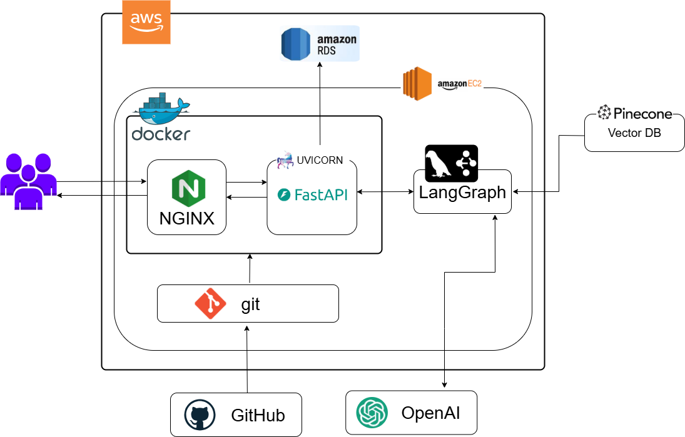

# Qook - AI 신선식품 챗봇 플랫폼

## 👥 팀원 소개 및 역할

**팀원: | 하종수 | 김광령 | 김성민 | 문상희 | 서은선 | 송유나 |**

## 📖 프로젝트 개요

### 주제 선정 및 배경
현대의 신선식품 구매 경험은 여전히 번거롭습니다. 원하는 상품을 찾기까지 경로가 복잡하고, 레시피에 맞춘 재료를 한번에 담기 어렵습니다. 문의 응답이 지연되어 의사결정이 늦어지며,식습관·알레르기를 반영한 개인화가 부족해 불필요한 비교와 반복 탐색이 발생합니다. 

이러한 문제점을 해결하기 위해 **AI 챗봇 기반의 신선식품 쇼핑 플랫폼**을 개발하게 되었습니다.

### 프로젝트 소개

**Qook**은 사용자가 자연어로 상품을 검색하고, 음식 사진으로 레시피를 찾으며, 주문부터 고객서비스까지 모든 과정을 AI 챗봇과의 대화만으로 완료할 수 있는 혁신적인 신선식품 플랫폼입니다.

---

## 📖 주요 기능

### 1. AI 챗봇 쇼핑
- **자연어 상품 검색**: "유기농 사과 2kg 주문하고 싶어요"
- **원터치 주문**: 대화만으로 장바구니 담기부터 결제까지
- **재고 실시간 확인**: 품절 상품 대체재 자동 제안

### 2. 비전 AI 레시피 검색
- **이미지 기반 레시피 탐색**: 음식 사진 업로드로 레시피 찾기
- **재료 자동 매칭**: 레시피 재료와 쇼핑몰 상품 연결

### 3. 통합 고객서비스
- **FAQ 자동 응답**: 일반적인 질문 즉시 해결
- **주문 조회**: "내 주문 상태 알려줘" - 실시간 배송 추적
- **스마트 환불**: 증빙 사진 업로드로 자동 환불 처리
- **상담사 연결**: 복잡한 문의 시 실시간 전문 상담

### 4. 개인화 서비스
- **멤버십 시스템**: Basic, Gold, Premium 등급별 혜택
- **구독 서비스**: 정기 주문 자동화, VIP 전담 매니저 고객 응대, 신상품 우선 구매
- **알레르기 필터링**: 개인 알레르기 정보 고려한 안전한 레시피 == 수정

### 5. 음성 인터페이스
- **음성 주문**: 핸즈프리 쇼핑 경험
- **실시간 음성 인식**: Whisper 기반 정확한 음성 변환

---

## 📊 데이터셋

### 데이터 소스
- **마켓컬리 FAQ**: 고객 서비스 질문/답변 데이터
- **마켓컬리 이용약관**: 정책 및 규정 정보
마켓컬리의 FAQ와 이용약관을 수집·분석하고, 이를 기반으로 당사 서비스 환경에 적합한 Qook 전용 더미데이터를 생성

### 🗂️ ERD
=> 첨부 예정

## 🏗️ 시스템 아키텍처 및 유저플로우

---

## 🎬 시연영상
유튜브 링크 첨부

## 💻 기술 스택
### ​ Front-End

   
   
  

### ​​ Back-End

  
  
  
  
  
  

### Model & AI

  
  
  
  
  
  
  

### 🖥️ Backend
| 기술 | 용도 |
|------|-----|
| **FastAPI** |웹 프레임워크 |
| **Python** | 백엔드 언어 |
| **LangGraph** | AI 워크플로우 관리 |
| **MySQL** | 관계형 데이터베이스 |
| **SQLAlchemy** | ORM |
| **Pydantic** | 데이터 검증 |
| **JWT** | 인증/인가 |

### 🤖 AI/ML
| 기술 | 용도 |
|------|------|
| **OpenAI GPT-4** | 자연어 처리, 대화 생성 |
| **GPT-4 Vision** | 이미지 분석, 음식 인식 |
| **Whisper** | 음성-텍스트 변환 |
| **Pinecone** | 벡터 검색, RAG |
| **Tavily** | 웹 검색 API |

### 🎨 Frontend
| 기술 | 용도 |
|------|------|
| **HTML5** | 마크업 |
| **Tailwind CSS** | UI 프레임워크 |
| **JavaScript** | 클라이언트 로직 |
| **Font Awesome** | 아이콘 |
| **Jinja2** | 템플릿 엔진 |

### 🛠️ DevOps & Tools
| 기술 | 용도 |
|------|-----|
| **Uvicorn** | ASGI 서버 |
| **Pytest** | 테스트 프레임워크 |
| **Black** | 코드 포맷터 |
| **Flake8** | 린터 |
| **Structlog** | 구조화된 로깅 |

### 📦 External APIs
| 서비스 | 용도 |
|--------|------|
| **Kakao Address API** | 주소 검색 |
| **OpenAI API** | AI 모델 호출 |
| **Pinecone API** | 벡터 검색 |
| **Tavily API** | 웹 검색 |
